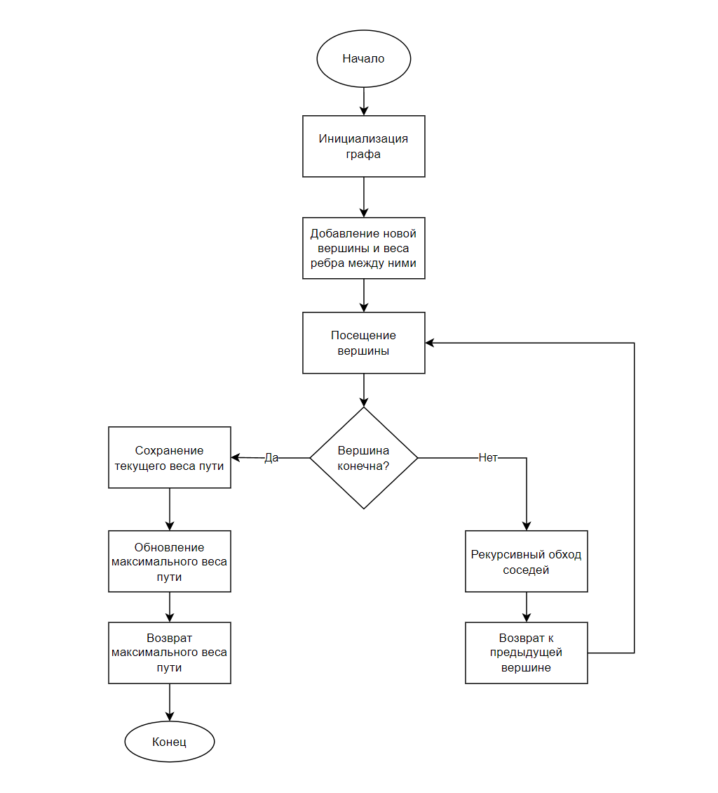
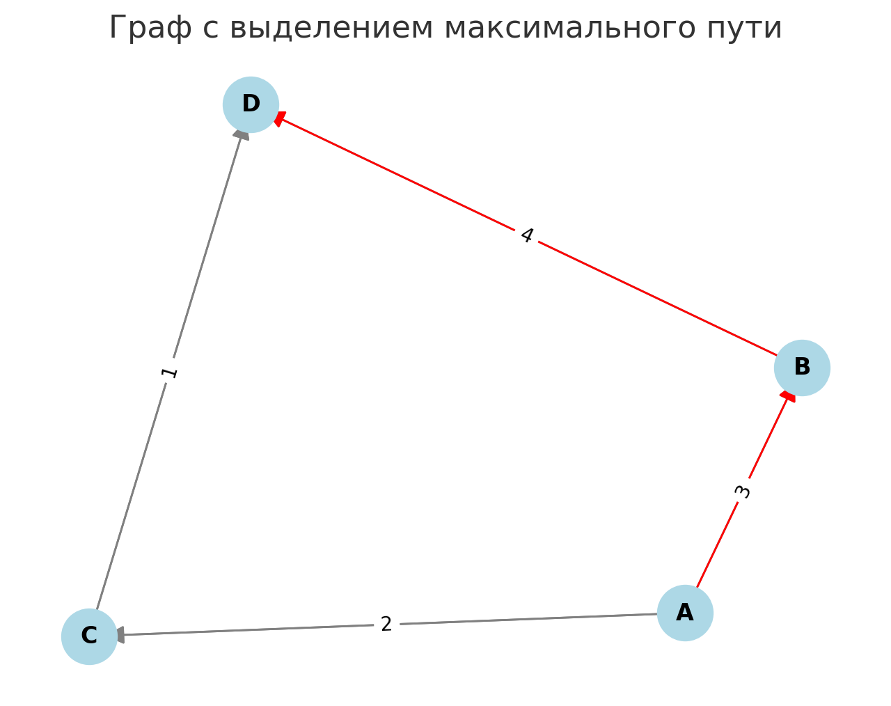
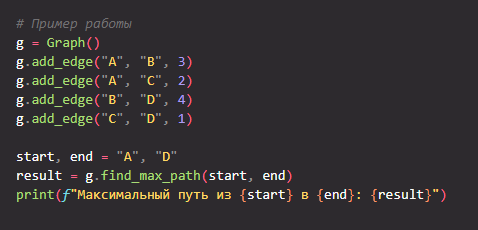
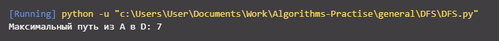

# Поиск максимального пути в нагруженном графе
Курсовая работа по дискретной математике

**Вариант**: 5 вариант

**Студент**: Бойцов Иван Алексеевич

---

## 1. Основные понятия и определения

1. **Граф**:
   - Набор вершин (узлов) и рёбер, соединяющих эти вершины.
   - Бывает **ориентированным** (рёбра имеют направление) или **неориентированным** (рёбра не имеют направления).

2. **Нагруженный граф**:
   - Граф, в котором каждому ребру присвоен вес (например, расстояние или стоимость).

3. **Путь**:
   - Последовательность рёбер, соединяющая начальную и конечную вершину. Вес пути — сумма весов рёбер, входящих в путь.

4. **Максимальный путь**:
   - Путь с наибольшей суммой весов среди всех возможных путей между двумя заданными вершинами.

5. **Ацикличный граф (DAG)**:
   - Ориентированный граф, не содержащий циклов.

6. **DFS (алгоритм обхода в глубину в первую очередь)**:
   - Алгоритм обхода графа, который углубляется по каждому пути, прежде чем переходить к следующему.

## 2. Описание алгоритма

### Модифицированный DFS для поиска максимального пути
1. **Инициализация**:
   - Граф представлен в виде списка смежности: каждая вершина содержит список своих соседей с весами рёбер.
   - Указываются начальная и конечная вершины.

2. **Рекурсивный обход графа**:
   - Из текущей вершины рекурсивно исследуются все пути к конечной вершине.
   - Суммарный вес пути сравнивается с текущим максимальным.

3. **Backtracking**:
   - После обработки всех соседей возвращаемся на предыдущую вершину, чтобы попробовать другие маршруты.

4. **Условия завершения**:
   - Если достигли конечной вершины, фиксируем текущий вес пути как потенциально максимальный.

## 3. Логическая блок-схема

## 4. Описание программы

### Основные модули:
- **Инициализация графа**: задаётся список смежности.
- **Алгоритм DFS**: реализован с учётом рекурсии.
- **Вывод результата**: отображается максимальный путь и его вес.

### Инструкции по использованию:
1. Установите Python 3.6+.
2. Запустите программу, указав вершины графа и начальную/конечную точки.
3. Ознакомьтесь с результатами в консоли.

## 5. Вычисление сложности алгоритма

- **Временная сложность**: \( O(V + E) \), где \( V \) — количество вершин, \( E \) — количество рёбер.
- **Пространственная сложность**: \( O(V) \) для хранения списка смежности и стека рекурсии.

## 6. Тестовый пример с решением

### Пример:
**Граф:**
- Вершины: A, B, C, D.
- Рёбра: 
  - A → B (вес 3),
  - A → C (вес 2),
  - B → D (вес 4),
  - C → D (вес 1).

**Начальная вершина**: A.  
**Конечная вершина**: D.  

**Результат**:
Максимальный путь: A → B → D.  
Вес пути: 7.

---

## 7. Скриншоты программы

## 8. Прикладная задача

### Задача: Оптимизация маршрутов грузоперевозок
- **Сценарий**:
  Компания ищет маршрут между пунктами с максимальной пропускной способностью.
- **Описание**:
  Вершины графа представляют пункты доставки, рёбра — маршруты, веса рёбер — грузоподъёмность.
- **Решение**:
  Алгоритм находит маршрут с максимальным весом между двумя пунктами.